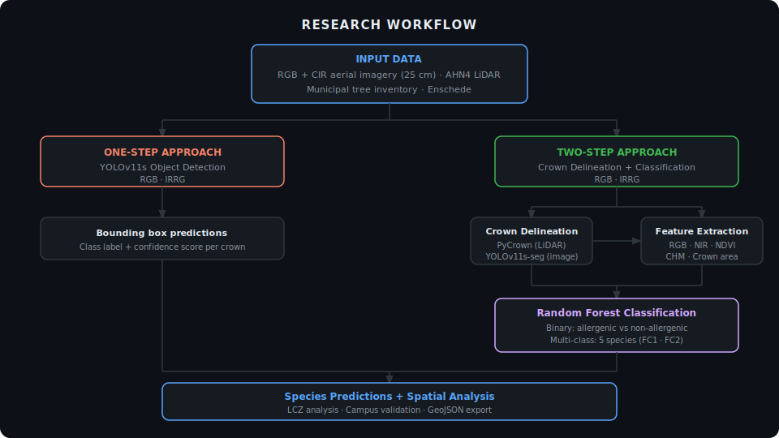

# Allergenic Tree Species Mapping in Urban Environments
### A Case Study of Enschede, the Netherlands

[](LICENSE)
[](https://www.python.org/)
[](https://github.com/ultralytics/ultralytics)
[](https://scikit-learn.org/)
[](https://doi.org/10.5281/zenodo.20600808)

> MSc Spatial Engineering thesis — Faculty of Geo-Information Science and Earth Observation (ITC), University of Twente, 2025–2026

---

## Overview

Urban trees are vital to city life — they improve air quality, reduce heat, and support physical and mental well-being. However, some species produce highly allergenic pollen, causing respiratory conditions such as asthma and rhinitis. Knowing where these species grow is essential for health risk assessments and evidence-based vegetation management.

Municipalities in the Netherlands maintain tree inventories, but these cover **public trees only**. Trees in private gardens, residential areas, and unmanaged green spaces — which make up a substantial part of urban vegetation — are left out. This gap makes comprehensive allergenic species mapping across a city impossible with traditional approaches alone.

This study explores whether AI-based methods can map five allergenic species — *Betula*, *Alnus*, *Fraxinus*, *Quercus*, and *Platanus* — across **both public and private areas** of Enschede, the Netherlands, using 25 cm aerial imagery and AHN4 LiDAR data. Two workflows were implemented and compared:

- **One-step** — YOLOv11s object detection directly detects and classifies species from image patches (RGB and IRRG configurations).
- **Two-step** — Tree crowns are first delineated using LiDAR-based PyCrown or image-based YOLOv11s-seg, then classified using a Random Forest model trained on spectral and structural features.

The two-step LiDAR + Random Forest workflow substantially outperformed the one-step approach, achieving ~62% overall accuracy after addressing class imbalance.

---

## Methodology



---

## Repository Structure

```
├── configs/                          # YOLO data configuration YAML files
├── data/
│   ├── raw/                          # Raw input data (not included — see Data section)
│   ├── interim/                      # Intermediate shapefiles (PyCrown output, GT prep)
│   ├── processed/                    # Processed splits, RF features, predictions
│   └── external/                     # Third-party datasets (not included — see Data section)
├── models/
│   ├── yolov11_detection/rgb|irrg/   # YOLO detection metric plots and results
│   └── yolov11_segmentation/rgb|irrg/# YOLO segmentation metric plots and results
├── notebooks/
│   ├── random_forest/                # RF pipeline (see Execution Order)
│   ├── yolo_detection/               # YOLO detection pipeline
│   └── yolo_segmentation/            # YOLO segmentation pipeline
├── scripts/
│   └── lidar_preprocessing/             # PDAL pipelines (.json) + CHM batch script (.bat)
├── src/                              # Shared path utilities
├── docs/                             # Figures and diagrams
├── .gitignore
├── LICENSE
├── README.md                         # This file
├── README.txt                        # Full archive metadata (university deposit)
└── requirements.txt                  # Python dependencies
```

> **Model weights** are not included in this repository due to file size. They are archived at the University of Twente data repository: `\\ad.utwente.nl\itc\Archive\CourseData\Upload\Herl_s3482170\models\`

---

## Data

The following input datasets are **not included** in this repository. Place them in the corresponding folders before running the notebooks.

| Dataset | Folder | Source |
|---|---|---|
| AHN4 LiDAR tiles (LAZ) | `data/raw/lidar_tiles/` | [geotiles.citg.tudelft.nl](https://geotiles.citg.tudelft.nl/) |
| RGB aerial imagery (25 cm) | `data/raw/rgb_tiles/` | [geotiles.citg.tudelft.nl](https://geotiles.citg.tudelft.nl/) |
| CIR aerial imagery (25 cm) | `data/raw/cir_tiles/` | [geotiles.citg.tudelft.nl](https://geotiles.citg.tudelft.nl/) |
| Enschede boundary (PDOK) | `data/raw/enschede_boundary/` | [pdok.nl](https://www.pdok.nl/introductie/-/article/administratieve-eenheden-inspire-geharmoniseerd) |
| Municipal tree inventory | `data/external/municipal_gt/` | 4TU.HERITAGE / Municipality of Enschede |
| Crown polygon shapefile | `data/external/crown_polygons_gt/` | 4TU.HERITAGE project |
| UT campus tree inventory | `data/external/ut_campus_gt/` | University of Twente |
| LCZ raster (Enschede) | `data/external/lcz_raster/` | [zenodo.org/records/8419340](https://zenodo.org/records/8419340) |

Tiles used: `34FN2` (train), `34FZ2` (val), `35AN1` (test). Imagery acquisition year: 2022.

---

## Installation

The notebooks were developed on the University of Twente CRIB computing platform (Python 3.8.10, NVIDIA RTX A4000). To reproduce locally:

```bash
pip install -r requirements.txt
```

> **Note for geospatial packages:** `geopandas`, `rasterio`, `shapely`, and `fiona` can have dependency conflicts when installed via pip on some systems. Using `conda-forge` is recommended if you are working in a conda environment.

**External tools** (not pip-installable):
- [PDAL](https://pdal.io) — point cloud processing (DTM/DSM generation)
- [GDAL CLI](https://gdal.org) — CHM merging, alignment, and computation
- [QGIS](https://qgis.org) — manual crown polygon refinement

---

## Execution Order

### LiDAR preprocessing — run once before anything else

```
scripts/lidar_preprocessing/
  1. pdal_dtm_idw.json          → generate DTM tiles from AHN4 point cloud
  2. pdal_dsm_max.json          → generate DSM from AHN4 point cloud
  3. chm_creation.bat           → merge DTM tiles, align extents, compute CHM
```

---

### Random Forest pipeline

```
notebooks/random_forest/

preprocessing/
  1. pycrown_crown_segmentation.ipynb     → delineate tree crowns from LiDAR
  2. crown_species_labelling.ipynb        → assign species labels from municipal inventory
  3. crown_feature_extraction.ipynb       → extract spectral + structural features

binary_classification/
  4. rf_binary_fc1.ipynb                  → binary RF — no NDVI (FC1)
  5. rf_binary_fc2.ipynb                  → binary RF — with NDVI (FC2)

multi_class_classification/
  6. rf_multiclass_fc1.ipynb              → multi-class RF — no NDVI (FC1)
  7. rf_multiclass_fc2.ipynb              → multi-class RF — NDVI + Quercus downsampling (FC2)

prediction_validation/
  8. campus_prediction_validation.ipynb   → validate predictions against UT campus inventory

lcz_analysis/
  9. lcz_species_analysis.ipynb           → analyse species distribution across LCZ classes
```

---

### YOLO object detection pipeline

```
notebooks/yolo_detection/

preprocessing/
  1. yolo_detection_gt_prep.ipynb              → prepare ground-truth shapefiles
  2. yolo_detection_rgb_tiles_prep.ipynb       → generate RGB patches + bbox labels
  3. yolo_detection_irrg_tiles_prep.ipynb      → generate IRRG patches + bbox labels

rgb/
  4. YOLOv11s_rgb.ipynb                        → train, validate, test RGB model

irrg/
  5. YOLOv11s_irrg.ipynb                       → train, validate, test IRRG model
```

---

### YOLO instance segmentation pipeline

```
notebooks/yolo_segmentation/

preprocessing/
  1. yolo_segmentation_gt_prep.ipynb           → prepare ground-truth shapefiles
  2. yolo_segmentation_rgb_tiles_prep.ipynb    → generate RGB patches + mask labels
  3. yolo_segmentation_irrg_tiles_prep.ipynb   → generate IRRG patches + mask labels

rgb/
  4. YOLOv11s-seg_rgb.ipynb                    → train, validate, test, export GeoJSON

irrg/
  5. YOLOv11s-seg_irrg.ipynb                   → train, validate, test, export GeoJSON
```

---

### Visualisation

```
notebooks/yolo_visualisation.ipynb    → inspect any YOLO dataset (detection or segmentation,
                                        RGB or IRRG) — set SPLITS_DIR, TASK, CLASS_NAMES
```

---

## Model Weights

Trained model weights are archived at the University of Twente data repository:

```
\\ad.utwente.nl\itc\Archive\CourseData\Upload\Herl_s3482170\models\
```

| Model | Task | Configuration |
|---|---|---|
| YOLOv11s | Object detection | RGB |
| YOLOv11s | Object detection | IRRG |
| YOLOv11s-seg | Instance segmentation | RGB |
| YOLOv11s-seg | Instance segmentation | IRRG |
| Random Forest | Binary classification | FC1 (no NDVI) |
| Random Forest | Binary classification | FC2 (with NDVI) |
| Random Forest | Multi-class classification | FC1 |
| Random Forest | Multi-class classification | FC2 (Quercus downsampled) |

**Load YOLO model:**
```python
from ultralytics import YOLO
model = YOLO('path/to/best.pt')
```

---

## Key Results

| Method | Configuration | Result |
|---|---|---|
| YOLOv11s detection | RGB | Limited — high background misclassification |
| YOLOv11s detection | IRRG | Limited — increased missed detections |
| YOLOv11s-seg segmentation | RGB | ~40% crown recall |
| YOLOv11s-seg segmentation | IRRG | ~42% crown recall |
| Random Forest binary | FC1 | 76.1% test accuracy |
| Random Forest binary | FC2 | 75.5% test accuracy |
| Random Forest multi-class | FC1 | 76.6% — biased toward Quercus |
| Random Forest multi-class | FC2 | 61.6% — balanced after downsampling |
| Campus validation (FC2) | — | ~63% of matched crowns correct |

---

## Citation

```
Herl, K.O. (2026). Artificial Intelligence for Allergenic Tree Species Mapping
in Urban Environments: A Case Study of Enschede. MSc thesis, Faculty of
Geo-Information Science and Earth Observation (ITC), University of Twente.

Source code: https://doi.org/10.5281/zenodo.20600808
```

---

## License

This repository is licensed under the [MIT License](LICENSE).
The license applies to the source code and notebooks only. Data files and
trained model weights are subject to separate terms as described in `README.txt`.

---

## Acknowledgements

Supervisors: Dr. Rosa Aguilar Bolivar and Dr. ir. Ellen-Wien Augustijn (ITC, University of Twente).

This research is associated with the [KAPPA research initiative](https://www.utwente.nl/en/itc/about-itc/centres-of-expertise/big-geodata/stories/story/making-allergy-burden-manageable-from-pollen-to-patient/) at ITC, University of Twente, which aims to model the spatial distribution of pollen allergies in the Netherlands.
